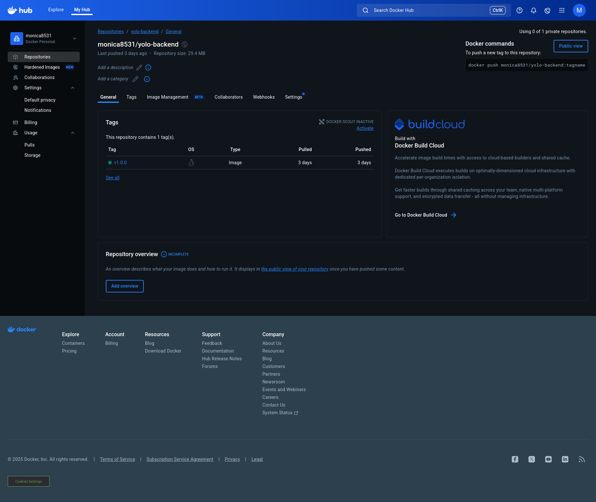
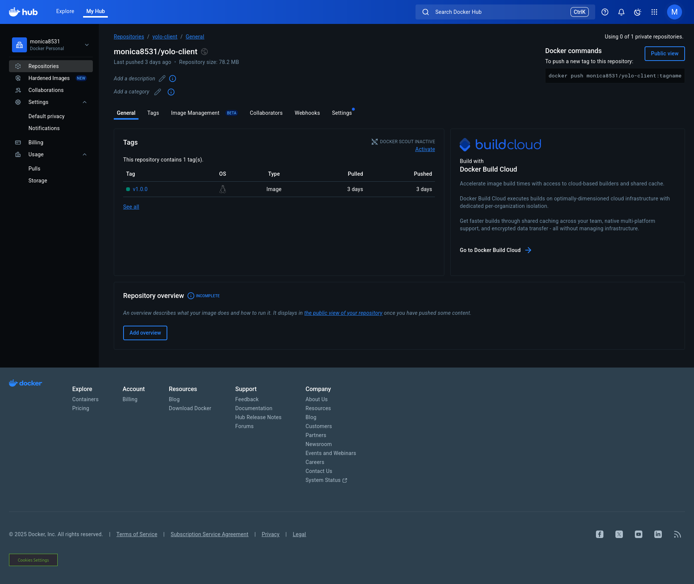

# 🛒 Yolo E-Commerce App

This is a **fully containerized full-stack e-commerce platform** built using **MongoDB, Express (Node.js), and React**, all orchestrated with **Docker and Docker Compose** for seamless development and deployment.

---

##  Local Setup

Local Set-up

To run this project locally on your machine follow these steps :

    Fork this repository to your GitHub account.

    Open your terminal.

    Clone the repository using the SSH URL:

    git clone

    Navigate into the project directory:

    cd yolo

    Open the project in VS Code:

    code .


## Base Image Selection

The Yolo E-Commerce App uses **optimized, secure, and lightweight Docker base images** to ensure faster builds, smaller image sizes, and enhanced security.

### 1. Backend – Node.js Server

### Build Stage
**Base Image:** `node:18-alpine`

**Why this image:**
- Lightweight and secure Node.js environment  
- Optimized for faster builds and quick dependency installation  
- Includes build tools for compiling native modules  
- Regularly updated with the latest security patches  
- Ideal for CI/CD pipelines and production-ready applications  

---

## Runtime Stage
**Base Image:** `alpine:3.18`

**Why this image:**
- Extremely small image size (~5 MB) for rapid deployment  
- Minimal packages reduce the attack surface  
- Excellent for lightweight apps and microservices  
- Works perfectly with multi-stage builds for smaller, cleaner images  
- Low memory footprint improves performance and scalability  


### 2. Frontend – React Application

|
## Build Stage
- **Base Image:** `node:18-alpine`  
- **Purpose:** Efficiently compiles and bundles the React application  
- **Why:**  
  - Lightweight and optimized for smaller image size  
  - Speeds up dependency installation  
  - Reduces overall build time  

---

### Runtime Stage
- **Base Image:** `nginx:alpine`  
- **Purpose:** Serves the built React static files  
- **Why:**  
  - Extremely fast and reliable for production  
  - Minimal image size ensures quick deployment  
  - Low resource usage for optimal performance  


### 3. Database – MongoDB

**Container:** MongoDB  
**Base Image:** `mongo:6`

**Why this image:**
- It’s the official and stable MongoDB image maintained by MongoDB Inc.  
- Fully supports **persistent volumes** to ensure data remains after container restarts.  
- Ideal for both **local development** and **production environments**.  
- Provides reliable performance and seamless integration with Node.js applications.  
- Regularly updated for **security and compatibility** improvements.


## Dockerfile Breakdown

### Backend – Node.js API (`./backend/Dockerfile`)

```dockerfile
FROM node:18-alpine AS build
WORKDIR /usr/src/app
COPY package*.json ./
RUN npm install
COPY . .

FROM alpine:3.18
WORKDIR /app
RUN apk add --no-cache nodejs
COPY --from=build /usr/src/app /app
ENV NODE_ENV=production
ENV PORT=5000
EXPOSE 5000
CMD ["node", "server.js"]
```

---

### Frontend – React App (`./client/Dockerfile`)

```dockerfile
FROM node:18-alpine AS build
WORKDIR /app
ENV NODE_OPTIONS=--openssl-legacy-provider
COPY package*.json ./
RUN npm install
COPY . .
RUN npm run build

FROM nginx:alpine
COPY --from=build /app/build /usr/share/nginx/html
EXPOSE 80
CMD ["nginx", "-g", "daemon off;"]
```

---

## Network Configuration

The system uses a **custom bridge network** for internal communication between containers.  
This allows services to reference each other by name while remaining isolated from the host environment.

```yaml
networks:
  yolo-network:
    driver: bridge
```

### Network Usage per Service

 ## MongoDB

Container Port: 27017

Host Port: 27017

Purpose: Provides database access for storing and retrieving data

## Backend (Node.js / Express)

Container Port: 5000

Host Port: 5000

Purpose: Runs the API server that handles client requests and communicates with the database

## Frontend (React + NGINX)

Container Port: 80

Host Port: 3000

Purpose: Serves the React application to users through NGINX

---

## Volume Setup

Persistent MongoDB data is stored using a named Docker volume:

```yaml
volumes:
  mongo-data:
```

This ensures your database data remains intact even after container restarts.

---

## Git Workflow Summary

The following steps summarize the workflow implemented in this project:

1. Created clean, multi-stage **Dockerfiles** for backend and frontend.  
2. Defined all services in `docker-compose.yaml` for MongoDB, backend, and frontend.  
3. Built and pushed both backend and frontend images to **DockerHub** with version tags.  
4. Documented the rationale behind base image selection.  
5. Explained Docker networking and volume persistence.  
6. Configured **Vagrant** and **Ansible** for environment automation and deployment.  
7. Added Kubernetes manifests for frontend, backend, and MongoDB services.  
8. Tested all builds locally and on Vagrant, ensuring proper inter-container communication.  
9. Updated the README.md with setup instructions and configuration details.

---

## Running the App

Make sure **Docker** and **Docker Compose** are installed on your machine.  
Then start the app by running:

```bash
docker-compose up --build
```

To stop the app:

```bash
docker-compose down
```

---

## DockerHub Images

| Service | Image | Tag |
|----------|--------|-----|
| Backend | `joyrose/yolo-backend` | `1.0.0` |
| Frontend | `joyrose/yolo-frontend` | `1.0.0` |

Both images are available on DockerHub and ready for use in CI/CD pipelines.

---

## Docker Hub Image Versions

Both the backend and frontend images were successfully built and pushed to Docker Hub.

- **Backend Image:** monica8531/yolo-backend:v1.0.0  
- **Frontend Image:** monica8531/yolo-client:v1.0.0  


**Client Image:**

## Docker Best Practices Implemented

- Used **multi-stage builds** to minimize final image size.  
- Applied **version tagging** for clarity and reproducibility.  
- Selected **lightweight base images** for faster, more secure builds.  
- Published **production-ready images** to DockerHub.  
- Enabled **persistent storage** for MongoDB using Docker volumes.  
- Configured **bridge networking** for container intercommunication.

---
Ansible & Vagrant Provision
Prerequisites

Install the following tools: VirtualBox Vagrant Ansible Docker Hub account (for image hosting)

After installation, verify that the installation is successful.
Procedures

First, access the repository where you'll be working from.
Clone the repository

cd yolo-ecommerce-deployment to the working repository.
"git clone https://github.com/KenanRicky/docker-compose-project.git"
Boot and Provision the VM

Create a vagrant Environment from a Vagrant Box.
In this case, I am using Ubuntu/jammy64 image.
"vagrant box add Ubuntu/jammy64".
Run vagrant box list to confirm if the box exists in your VM list.
Use "vagrant init" to create the environment
"Vagrant Up" to start up the Virtual Machine.
You can verify that the VM is running correctly by SSHing into it.
Create Ansible Files and Directories

The files include:

    ansible.cfg
    roles
    playbook.yaml
    inventory.yaml
    hosts

Note: Ignore the .vagrant directory to avoid looping into it in every provision made.
hosts

This is an inventory where all the VM machines are listed using their IP addresses and other connectivity avenues, like ports.
127.0.0.1 ansible_port 2222
ansible.cfg

This is where the defaults are declared.

[defaults]

inventory = hosts
remote_user = vagrant.
private_key_file = .vagrant/machines/default/virtualbox/private_key.
playbook.yaml

This is where the commands that are to be executed on the server get declared.
NOTE: The provision must be defined in the vagrant file by adding the line.
"config.vm.provision "ansible" do |ansible| ansible.playbook = "playbook.yaml end" at the very end.
roles

This is where related tasks are grouped to ensure good practice.
Roles are created using ansible-galaxy. All tasks are defined in the roles. docker-installation – Installs Docker and Docker Compose.
frontend-deployment – Pulls/builds and runs the React frontend container.
backend-deployment – Pulls/builds and runs the backend Node.js container.
setup-mongodb - Sets up Mongodb.
docker-install - Installs Docker to the VM.
Vagrant Provision

This will give the connectivity to the virtual machine. In case of any error, You'll be able to provision while debugging until all goes successful! Screenshot from 2025-07-29 12-20-36

## Author

**Monica Michelle Njeri Mwangi**  
*Full Stack Developer | Docker | Node.js | React | MongoDB | 
